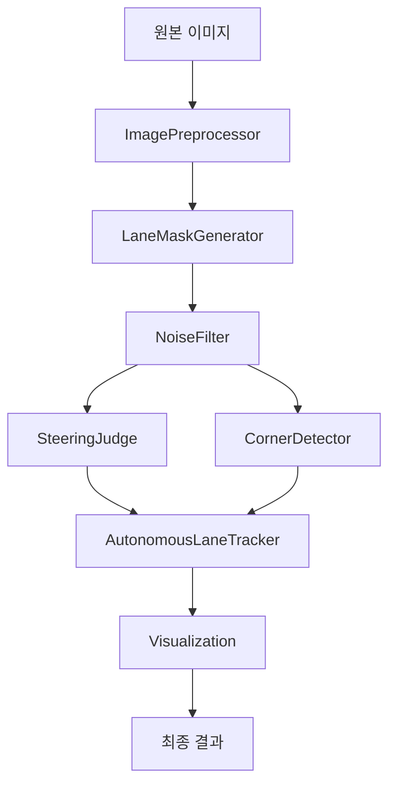

# 🧩 AI 모듈 구조 (V2)

자율주행 시스템의 AI 모듈이 기능별로 구조화되었습니다.

## 📁 폴더 구조

```
ai/
├── core/                   # 핵심 모듈
│   ├── __init__.py
│   └── autonomous_lane_tracker.py
│
├── detectors/             # 감지 모듈
│   ├── __init__.py
│   ├── lane_detector.py
│   ├── yolo_detector.py
│   ├── corner_detector.py
│   └── steering_judge.py
│
├── filters/              # 전처리/필터링
│   ├── __init__.py
│   ├── image_preprocessor.py
│   ├── lane_mask_generator.py
│   └── noise_filter.py
│
├── visualization/        # 시각화
│   ├── __init__.py
│   └── visualization.py
│
└── utils/               # 유틸리티
    └── __init__.py
```

## 📦 모듈 설명

### 1. core/ - 핵심 모듈

**`autonomous_lane_tracker.py`**
- 자율주행 메인 클래스 (`AutonomousLaneTrackerV2`)
- 전체 파이프라인 조율
- 모든 컴포넌트 통합

### 2. detectors/ - 감지 모듈

**`lane_detector.py`**
- 기본 차선 감지 (데모용)
- OpenCV 기반 차선 검출

**`yolo_detector.py`**
- YOLOv8 객체 감지
- 장애물/표지판 인식

**`corner_detector.py`**
- 90도 코너 감지
- LookAhead ROI 분석

**`steering_judge.py`**
- 조향 판단 로직
- 히스토그램 기반 LEFT/RIGHT/CENTER 결정

### 3. filters/ - 전처리/필터링

**`image_preprocessor.py`**
- CLAHE 전처리
- 가우시안 블러
- ROI 추출

**`lane_mask_generator.py`**
- HSV 색상 기반 차선 검출
- 흰색/빨간색 차선 마스크

**`noise_filter.py`**
- 빛 반사 노이즈 제거
- 컨투어 필터링

### 4. visualization/ - 시각화

**`visualization.py`**
- 분석 결과 오버레이
- 히스토그램 그래프
- 상태 표시

### 5. utils/ - 유틸리티

향후 추가될 공통 유틸리티 함수들을 위한 공간

## 🔄 데이터 흐름



## 🎯 사용 예시

### 1. 전체 파이프라인

```python
from ai.core import AutonomousLaneTrackerV2

tracker = AutonomousLaneTrackerV2(
    brightness_threshold=80,
    use_adaptive=True
)

result = tracker.process_frame(image, debug=True)
print(f"명령: {result['command']}")
```

### 2. 개별 모듈 사용

```python
# 이미지 전처리
from ai.filters import ImagePreprocessor
preprocessor = ImagePreprocessor()
enhanced = preprocessor.apply_clahe(image)

# 노이즈 제거
from ai.filters import NoiseFilter
noise_filter = NoiseFilter(min_area=100)
clean = noise_filter.remove_noise(mask)

# 객체 감지
from ai.detectors import YOLODetector
detector = YOLODetector()
objects = detector.detect(image)
```

## 🔧 설정 가능한 파라미터

### ImagePreprocessor
```python
clahe = cv2.createCLAHE(
    clipLimit=2.0,
    tileGridSize=(8, 8)
)
```

### LaneMaskGenerator
```python
HSV_WHITE_BRIGHT = {
    "lower": (0, 0, 200),
    "upper": (180, 30, 255)
}
```

### NoiseFilter
```python
min_area = 100
min_aspect_ratio = 2.0
```

### SteeringJudge
```python
THRESHOLD_DEADZONE = 0.15
THRESHOLD_RATIO = 1.3
```

## 🔍 디버그 모드

```python
result = tracker.process_frame(image, debug=True)
debug_images = result["debug_images"]

# 단계별 이미지 확인
cv2.imshow("1. CLAHE", debug_images["1_clahe"])
cv2.imshow("2. Blur", debug_images["2_blurred"])
cv2.imshow("3. ROI", debug_images["3_roi_bottom"])
cv2.imshow("4. Mask", debug_images["5_mask"])
cv2.imshow("5. Clean", debug_images["6_clean_mask"])
cv2.imshow("6. Final", debug_images["7_final"])
```

## 📊 성능 지표

| 단계 | 처리 시간 |
|------|----------|
| CLAHE | ~5ms |
| ROI + HSV | ~3ms |
| 노이즈 제거 | ~10ms |
| 판단 | ~2ms |
| **총계** | **~20ms** |

## 🔄 업데이트 내역

### V2 (2025-10-22)
- ✅ 모듈 구조화 (5개 폴더)
- ✅ 기능별 분리
- ✅ 문서화 개선
- ✅ 성능 최적화

### V1
- 단일 파일 구조
- 기본 기능 구현

## 📚 관련 문서

- `AUTONOMOUS_GUIDE.md`: 전체 시스템 가이드
- `prod.md`: 알고리즘 설계 문서
- 각 모듈의 docstring

---

## 🛠️ 개발 환경

- Python 3.13+
- OpenCV 4.8+
- NumPy 1.26+
- PyTorch 2.0+ (YOLO용)

## 🔄 CI/CD

```yaml
# .github/workflows/test.yml
name: AI Module Tests

on: [push, pull_request]

jobs:
  test:
    runs-on: ubuntu-latest
    steps:
      - uses: actions/checkout@v2
      - name: Set up Python
        uses: actions/setup-python@v2
        with:
          python-version: '3.13'
      - name: Install dependencies
        run: |
          pip install -r requirements.txt
      - name: Run tests
        run: |
          python -m pytest tests/ai/
```

## 🎯 향후 계획

1. **utils/ 모듈 추가**
   - 이미지 변환 유틸리티
   - 좌표 변환 함수
   - 성능 측정 도구

2. **성능 최적화**
   - CUDA 지원 추가
   - 멀티스레딩 처리
   - 메모리 사용량 최적화

3. **새로운 기능**
   - 차선 곡률 계산
   - 거리 추정
   - 다중 객체 추적

---

**작성일**: 2025-10-22  
**버전**: 2.0  
**작성자**: AI Assistant
